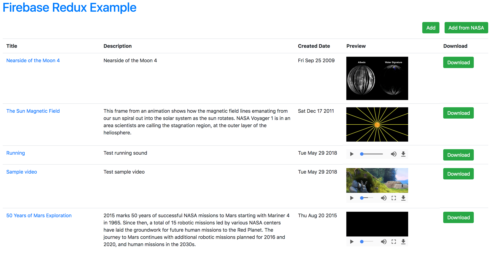

# Working Demo

[Demo video on Youtube](https://www.youtube.com/watch?v=705iZpzMyKY)

[](https://www.youtube.com/watch?v=705iZpzMyKY)

# Configuration

You need to update `config` variable in `index.html` with your [Firebase](https://firebase.google.com/) account configuration. This demo uses Firebase database and storage services.

# Installation

`yarn install`

`yarn build`

`yarn firebase` to start local server at `http://localhost:8080`

### 1. Write an application in React JS:

*Must use Redux or any state management libraries*

[ ] Displays a list of data below. Each item contain: title, date created, description, image | video | audio ...

Title             |  Description    |  Date created   |  Preview          |  Download         |
------------------|-----------------|-----------------|-------------------|-------------------|
Title example #1  |  ...            |  May 9, 2003    |  [IMAGE]          |  [DOWNLOAD BTN]   |
Title example #2  |  ...            |  May 10, 2003   |  [VIDEO PLAYER]   |  [DOWNLOAD BTN]   |
Title example #3  |  ...            |  May 11, 2003   |  [AUDIO PLAYER]   |  [DOWNLOAD BTN]   |
...               |  ...            |  ...            |  ...              |  ...              |

[x] Must use a CSS framework: Bootstrap, Semantics, Foundation...

[ ] User can add an item using ALL OF THE methods listed below:

  [ ] Method1: Form with simple search text inputs
  ```
  - Use NASA OPEN APIs [https://api.nasa.gov]
  ```

  [ ] Method2: Form with all field inputs
  ```
  Validation rules are as followed:
  - "Title", "Preview" is always required.
  - User can only upload filetype base on media type.
  ```
[ ] The list should use Google Firebase to store data

[ ] User can play with [VIDEO PLAYER] | [AUDIO PLAYER]

[ ] The list should contain pagination and able to modify items per page.

[ ] User should be able to Edit, Delete item in the list.

[ ] User should be able to export a CSV file containing all of the items

### 2. Push your application into any of Git service you like.
### 3. Deploy your application to Heroku or any server that you have
